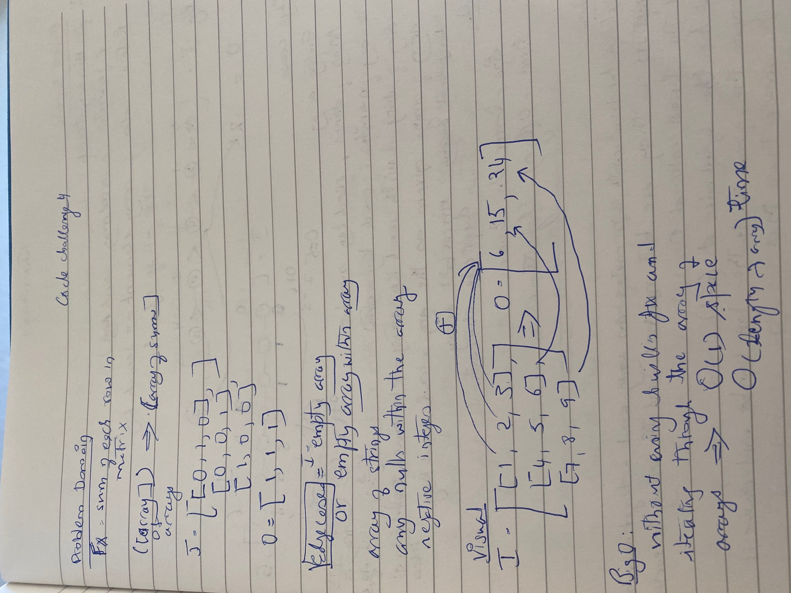

# Sum of numbers in a Matrix

[Table of Contents](../../../README.md)

See [solution](array_sum_of_matrix.py)

__Pull Request__:https://github.com/vijayetar/dsa/pull/1

Function to add up the sum of each row in a matrix and return an array with the appropriate values.

## Challenge
1. Write a function to add up the sum of each row in a matrix of arbitrary size
2 Return an array with the appropriate values.
3. Avoid utilizing any of the built-in methods available to your language.
4. The matrix will always be full of integers.
5. Negative values are possible.
6. All nulls will be counted as zeros.

## Approach and Efficiency
* I checked for edge cases for empty array
* I approached it by using a for loop to iterate over the array of arrays, and then a nested for loop to iterate over each of the arrays.
* Using a variable sum, I added the numbers of each of the array
* The null values are accounted to zero.
* The sum value is appended to a new list and returned.
* This is inefficient use of time and space since the space will be used linearly and time will be used exponentially.

## Specifications Used
* .editorconfig
* .gitattributes
* .gitignore

## Solution

## Checklist
 - [x] Top-level README “Table of Contents” is updated
 - [x] Feature tasks for this challenge are completed
 - [x] Return an array of sum of numbers
 - [x] Unit tests written and passing
     - [x] “Happy Path” - Expected outcome
     - [x] Expected failure
     - [x] Edge Case (if applicable/obvious)
 - [x] README for this challenge is complete
     - [x] Summary, Description, Approach & Efficiency, Solution
     - [x] Link to code
     - [x] Picture of whiteboard
