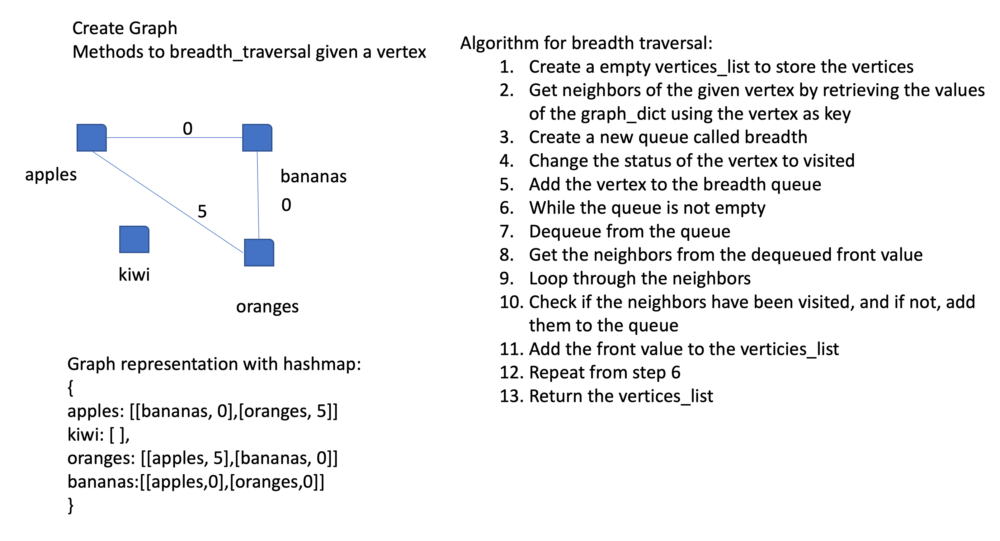

# Breadth_First_Graph

[Table of Contents](../../../README.md)

See [solution](breadth_first_graph.py)

__PR__:https://github.com/vijayetar/dsa/pull/30

## Challenge
Extend your graph object with a breadth-first traversal method that accepts a starting node. Without utilizing any of the built-in methods available to your language, return a collection of nodes in the order they were visited. Display the collection.

## Approach and Efficiency
I used the built in methods to check for the edges and then add each vertex in a new list called vertices and returned at the end.

This is at best a O(1) approach to add to the the vertices list, get the neighbors from a dictionary and then review the values adding it to the verticies if they do not exist there.

I had some difficulty in changing the visited status of the verticies, and so there was some redundant code and extra looping that i would prefer that did not exist.

so my space is the connected vertices O(n) and time efficiency is O(1)

## Specifications Used
* .editorconfig
* .gitattributes
* .gitignore

## Solution

## Checklist
 - [x] Top-level README “Table of Contents” is updated
 - [x] Feature tasks for this challenge are completed
 - [x] Unit tests written and passing
     - [x] “Happy Path” - Expected outcome
     - [x] Expected failure
     - [x] Edge Case (if applicable/obvious)
 - [x] README for this challenge is complete
     - [x] Summary, Description, Approach & Efficiency, Solution
     - [x] Link to code
     - [x] Picture of whiteboard
