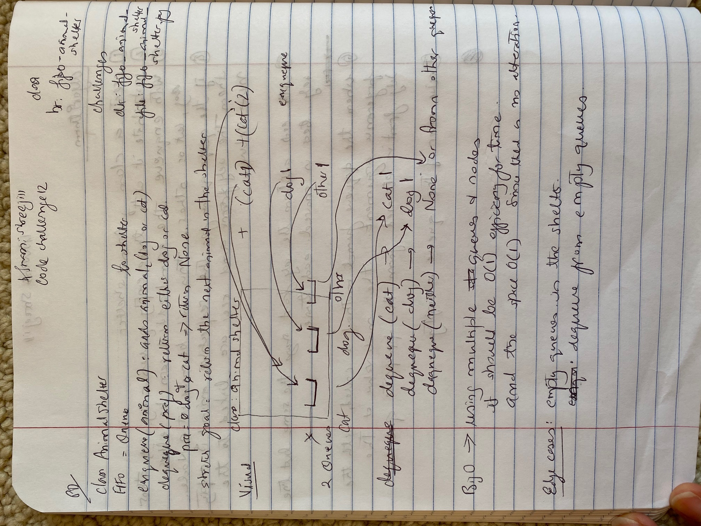

# Fifo Animal Shelter

[Table of Contents](../../../README.md)

See [solution](fifo_animal_shelter.py)

__PR__: https://github.com/vijayetar/dsa/pull/12

## Challenge
Create a __class called AnimalShelter__ which holds only dogs and cats. The shelter operates using a first-in, first-out approach.
Implement the following methods:
__enqueue(animal)__: adds animal to the shelter. animal can be either a dog or a cat object.
__dequeue(pref)__: returns either a dog or a cat. If pref is not "dog" or "cat" then return null.

## Approach and Efficiency
I used the Queue class by using Nodes, to create three separate Queue instantiation when the Animal Shelter class is instantiated.  Each separate Queue is for cat, dog and other animals with each Queue having a self.front and self.rear to be able to do all the methods in O(1) use of space and efficiency.

I was able to create enqueue, dequeue, peek and isEmpty for the shelter class, through the same methods for each of the Queue class.

## Specifications Used
* .editorconfig
* .gitattributes
* .gitignore

## Solution

## Checklist
 - [x] Top-level README “Table of Contents” is updated
 - [x] Feature tasks for this challenge are completed
 - [x] Unit tests written and passing
     - [x] “Happy Path” - Expected outcome
     - [x] Expected failure
     - [x] Edge Case (if applicable/obvious)
 - [x] README for this challenge is complete
     - [x] Summary, Description, Approach & Efficiency, Solution
     - [x] Link to code
     - [x] Picture of whiteboard
