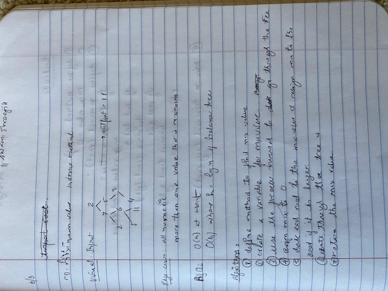
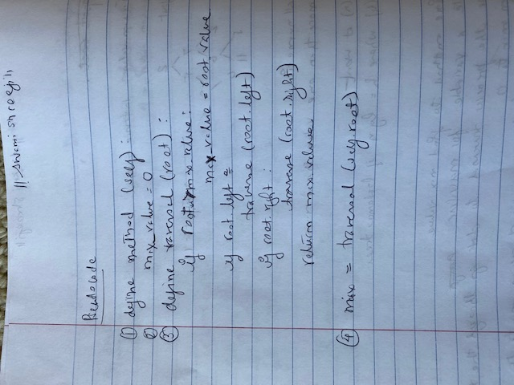

# Find Max Value in a Binary Tree

[Table of Contents](../../../README.md)

See [solution](find_max_binary_tree.py)

__PR__:https://github.com/vijayetar/dsa/pull/18

## Challenge
Write an __instance method__ called __find-maximum-value__. Without utilizing any of the built-in methods available to your language, __return the maximum value__ stored in the tree. You can assume that the values stored in the Binary Tree will be numeric.

## Approach and Efficiency
I used an O(n) approach to finding the maximum using a max value as an argument in a recursive function that compares the root value against the max value and finds the maximum number that is returned through each recursion and then returned at the end of the function execution.

## Specifications Used
* .editorconfig
* .gitattributes
* .gitignore

## Solution

## Checklist
 - [x] Top-level README “Table of Contents” is updated
 - [x] Feature tasks for this challenge are completed
 - [x] Unit tests written and passing
     - [x] “Happy Path” - Expected outcome
     - [x] Expected failure
     - [x] Edge Case (if applicable/obvious)
 - [x] README for this challenge is complete
     - [x] Summary, Description, Approach & Efficiency, Solution
     - [x] Link to code
     - [x] Picture of whiteboard
