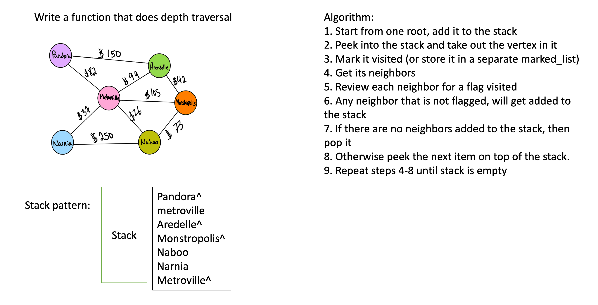

# Depth First Traversal

[Table of Contents](../../../README.md)

See [solution](graph_depth_first.py)

__PR__:https://github.com/vijayetar/dsa/pull/32

## Challenge
Create a function that accepts an adjacency list as a graph, and conducts a depth first traversal. Without utilizing any of the built-in methods available to your language, return a collection of nodes in their pre-order depth-first traversal order.

## Approach and Efficiency
I used O(1) approach to get the neighbors, but it took a couple of loops to iterate through the loop, as well as through the list of vertices visited to ensure that we do not double up on the vertices.

## Specifications Used
* .editorconfig
* .gitattributes
* .gitignore

## Solution

## Checklist
 - [x] Top-level README “Table of Contents” is updated
 - [x] Feature tasks for this challenge are completed
 - [x] Unit tests written and passing
     - [x] “Happy Path” - Expected outcome
     - [x] Expected failure
     - [x] Edge Case (if applicable/obvious)
 - [x] README for this challenge is complete
     - [x] Summary, Description, Approach & Efficiency, Solution
     - [x] Link to code
     - [x] Picture of whiteboard
