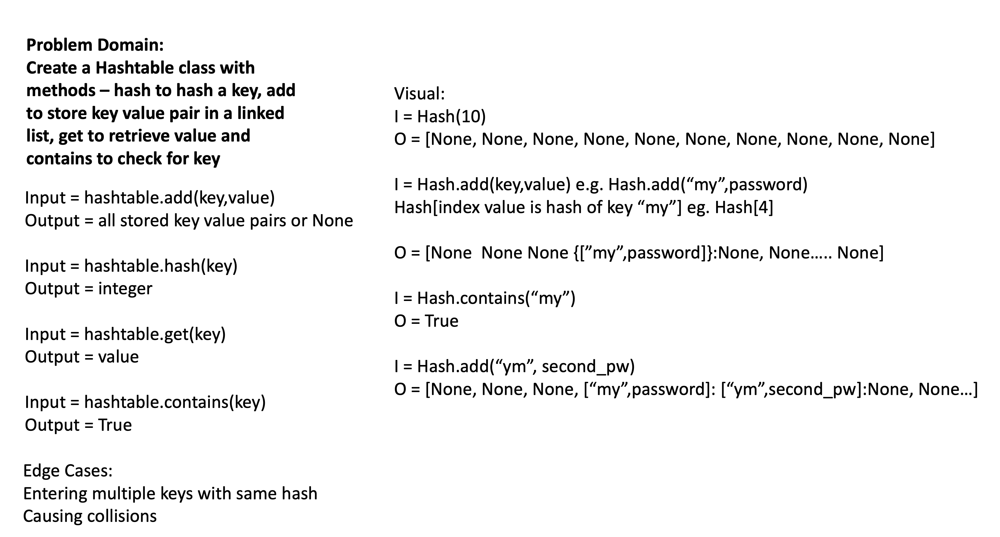
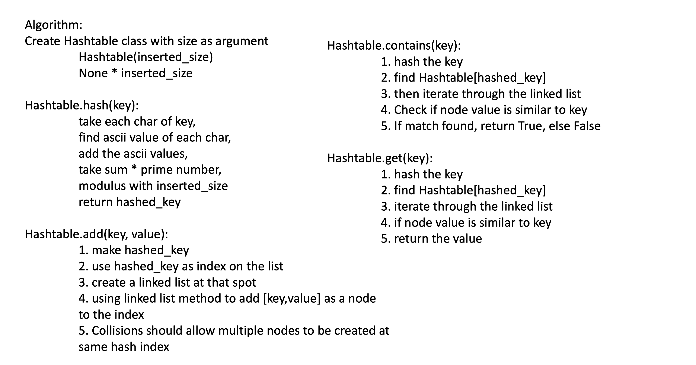

# Hashtable

[Table of Contents](../../../README.md)

See [solution](hashtable.py)

__PR__:https://github.com/vijayetar/dsa/pull/24

## Challenge
Implement a Hashtable with the following methods:

[] add: takes in both the key and value. This method should hash the key, and add the key and value pair to the table, handling collisions as needed.
[] get: takes in the key and returns the value from the table.
[] contains: takes in the key and returns a boolean, indicating if the key exists in the table already.
[] hash: takes in an arbitrary key and returns an index in the collection.

## Approach and Efficiency
The hashtable construction is an interesting implementation of O(1) efficiency when you have a O(n) list created to store data.

When a Hashtable is created, the size determines how many indices are available for storing. So the smaller the size, more collisions, but the bigger the size of the list, the more empty spaces there are with inefficient use of space.

The use of the hash to find the index and then store the key value pair as a linked list, allows the methods of get and contains in a O(1) manner.

## Specifications Used
* .editorconfig
* .gitattributes
* .gitignore

## Solution

## Checklist
 - [x] Top-level README “Table of Contents” is updated
 - [x] Feature tasks for this challenge are completed
 - [x] Unit tests written and passing
     - [x] “Happy Path” - Expected outcome
     - [x] Expected failure
     - [x] Edge Case (if applicable/obvious)
 - [x] README for this challenge is complete
     - [x] Summary, Description, Approach & Efficiency, Solution
     - [x] Link to code
     - [x] Picture of whiteboard
