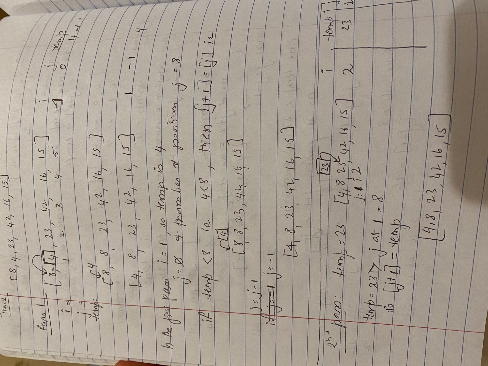

# Insertion Sort

[Table of Contents](../../../README.md)

See [solution](insertion_sort.py)

__PR__: https://github.com/vijayetar/dsa/compare/insertion-sort?expand=1

## Challenge
Review the pseudocode below, then trace the __algorithm__ by stepping through the process with the provided sample array. __Document your explanation__ by creating a blog article that shows the step-by-step output after each iteration through some sort of visual.

## Pseudocode
```
  InsertionSort(int[] arr)

    FOR i = 1 to arr.length

      int j <-- i - 1
      int temp <-- arr[i]

      WHILE j >= 0 AND temp < arr[j]
        arr[j + 1] <-- arr[j]
        j <-- j - 1

      arr[j + 1] <-- temp
```

## Approach and Efficiency
[doc-file](https://docs.google.com/document/d/13T32WeVWvSeR-tmqzqHc3tJOKLl3lpGGy8nPNRZHfPY/edit?usp=sharing)

The approach in the worst case scenario with a reverse sorted list, would be to check each number with O(n) against the previous numbers with O(n). so the worst scenario is O(n^2).

In the average cases, where the inner loop can be interrupted, the efficiency would be O(n^2/2).

And in the best case, where the list is already sorted in ascending order, it would be O(n) only.

## Specifications Used
* .editorconfig
* .gitattributes
* .gitignore

## Solution



## Checklist
 - [x] Top-level README “Table of Contents” is updated
 - [x] Feature tasks for this challenge are completed
 - [x] Unit tests written and passing
     - [x] “Happy Path” - Expected outcome
     - [x] Expected failure
     - [x] Edge Case (if applicable/obvious)
 - [x] README for this challenge is complete
     - [x] Summary, Description, Approach & Efficiency, Solution
     - [x] Link to code
     - [x] Picture of whiteboard
