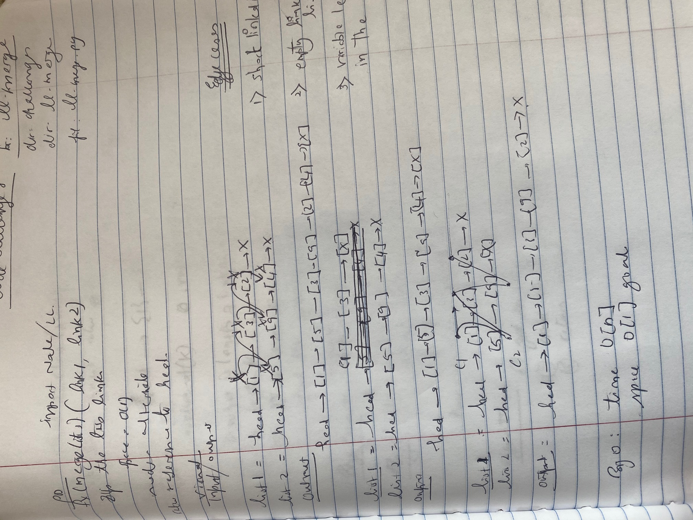
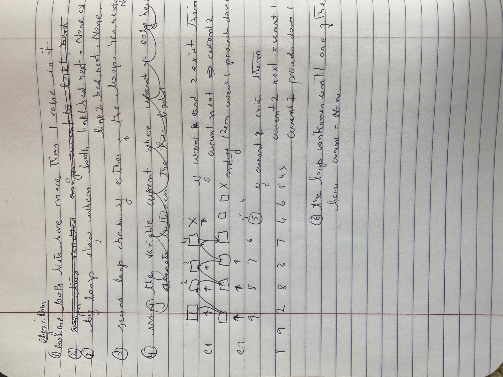

# Merging Linked Lists

[Table of Contents](../../../README.md)

See [solution](ll_merge.py)

__PR__: https://github.com/vijayetar/dsa/pull/7

## Challenge
Write a function called __mergeLists__ which takes two linked lists as arguments. Zip the two linked lists together into one so that the nodes alternate between the two lists and return a reference to the head of the zipped list. Try and keep additional space down to O(1). You have access to the Node class and all the properties on the Linked List class as well as the methods created in previous challenges.

## Approach and Efficiency
I used O(n) approach to merge list without using list as a container object.  In this case there is a scout variable that proceeds along the lists and a current variable that is joining to the previous current node and then to the scout ahead of the list 1. The space used is O(1) since no new object is created.

## Specifications Used
* .editorconfig
* .gitattributes
* .gitignore

## Solution

## Checklist
 - [x] Top-level README “Table of Contents” is updated
 - [x] Feature tasks for this challenge are completed
 - [x] Unit tests written and passing
     - [x] “Happy Path” - Expected outcome
     - [x] Expected failure
     - [x] Edge Case (if applicable/obvious)
 - [x] README for this challenge is complete
     - [x] Summary, Description, Approach & Efficiency, Solution
     - [x] Link to code
     - [x] Picture of whiteboard
