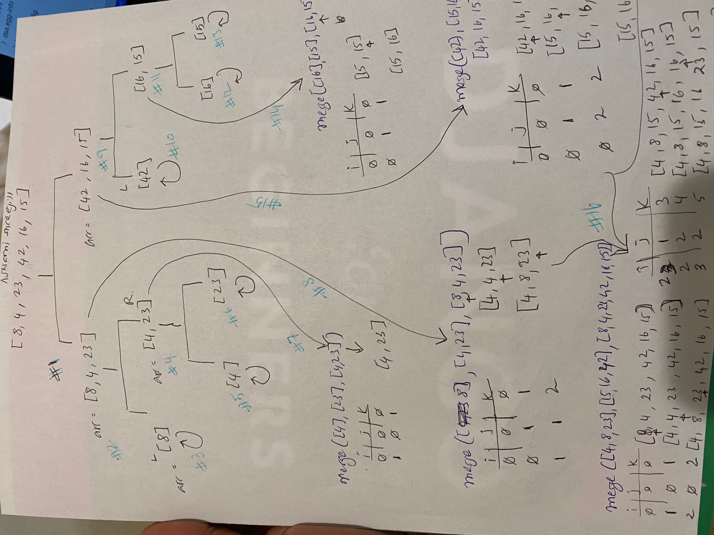

# Merge Sort

[Table of Contents](../../../README.md)

See [solution](merge_sort.py)

__PR__: https://github.com/vijayetar/dsa/pull/21

## Challenge
Review the pseudocode below, then trace the algorithm by stepping through the process with the provided sample array.

```
ALGORITHM Mergesort(arr)
    DECLARE n <-- arr.length

    if n > 1
      DECLARE mid <-- n/2
      DECLARE left <-- arr[0...mid]
      DECLARE right <-- arr[mid...n]
      // sort the left side
      Mergesort(left)
      // sort the right side
      Mergesort(right)
      // merge the sorted left and right sides together
      Merge(left, right, arr)

ALGORITHM Merge(left, right, arr)
    DECLARE i <-- 0
    DECLARE j <-- 0
    DECLARE k <-- 0

    while i < left.length && j < right.length
        if left[i] <= right[j]
            arr[k] <-- left[i]
            i <-- i + 1
        else
            arr[k] <-- right[j]
            j <-- j + 1

        k <-- k + 1

    if i = left.length
       set remaining entries in arr to remaining values in right
    else
       set remaining entries in arr to remaining values in left
```

## Approach and Efficiency
The approach is to divide the array into halves, until only zero order of number is found. Then, each half is sorted, until both halves are sorted to return a sorted array.

The approach depends on O(n) at the best, and O(n)xlog n at the worst.

## Specifications Used
* .editorconfig
* .gitattributes
* .gitignore

## Solution
[Whiteboard](https://docs.google.com/document/d/1DAHjPhQ3Su--KyM8aHM6LGw-fFpVILrYMSGHatanrOs/edit?usp=sharing)



## Checklist
 - [x] Top-level README “Table of Contents” is updated
 - [x] Feature tasks for this challenge are completed
 - [x] Unit tests written and passing
     - [x] “Happy Path” - Expected outcome
     - [x] Expected failure
     - [x] Edge Case (if applicable/obvious)
 - [x] README for this challenge is complete
     - [x] Summary, Description, Approach & Efficiency, Solution
     - [x] Link to code
     - [x] Picture of whiteboard
