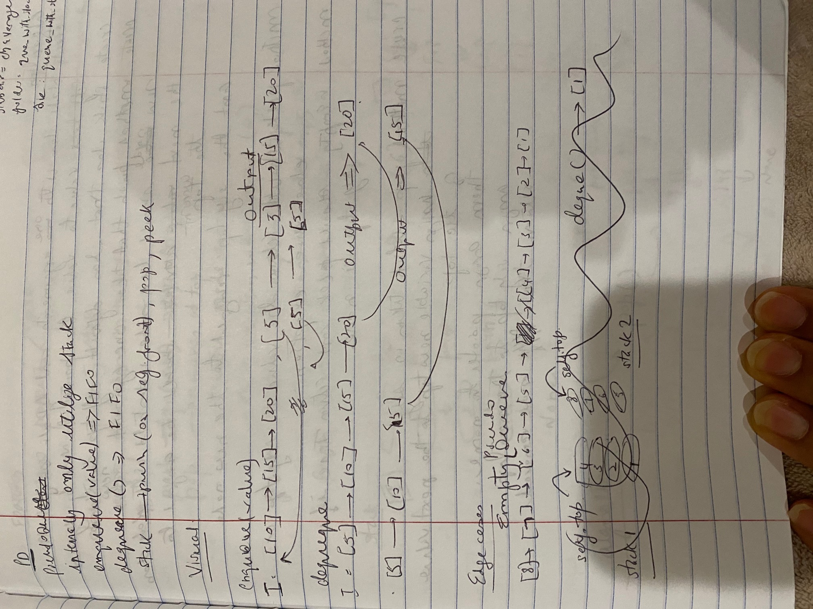
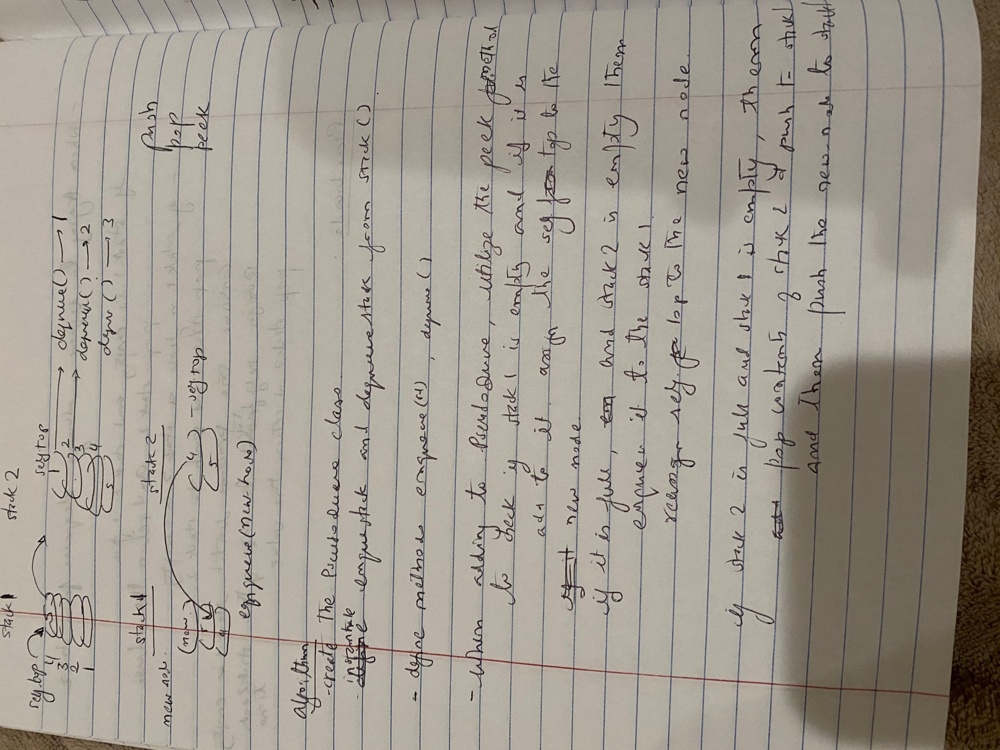
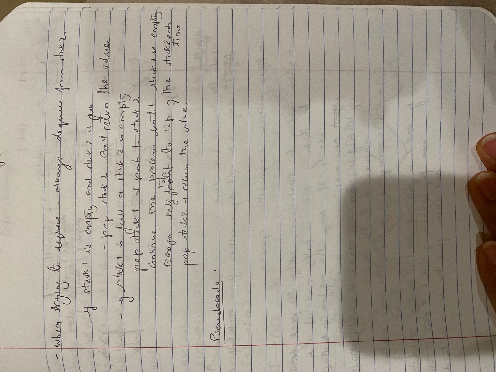

# Queue with Stacks

[Table of Contents](../../../README.md)

See [solution](queue_with_stacks.py)

__PR__: https://github.com/vijayetar/dsa/pull/11

## Challenge
Create a brand new PseudoQueue class and will internally only utilize 2 Stack objects.
It will have the following methods:
i __enqueue(value)__ which inserts value into the PseudoQueue, using a first-in, first-out approach.
ii __dequeue()__ which extracts a value from the PseudoQueue, using a first-in, first-out approach.
The Stack instances have only push, pop, and peek methods.

## Approach and Efficiency
The methods within the Stack class ie push, pop and peek methods use O(1) approach.  I was able to use these same methods between the two stacks to find the front and the rear of the psuedoqueue and then either add to the rear or take it out from the front of the queue.

However, since we are also using two stacks, and emptying between them, we have increased our space/efficiency to O(n).

## Specifications Used
* .editorconfig
* .gitattributes
* .gitignore

## Solution

## Checklist
 - [x] Top-level README “Table of Contents” is updated
 - [x] Feature tasks for this challenge are completed
 - [x] Unit tests written and passing
     - [x] “Happy Path” - Expected outcome
     - [x] Expected failure
     - [x] Edge Case (if applicable/obvious)
 - [x] README for this challenge is complete
     - [x] Summary, Description, Approach & Efficiency, Solution
     - [x] Link to code
     - [x] Picture of whiteboard
