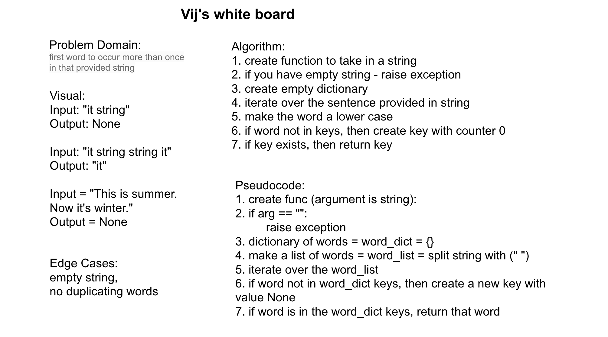

# Repeated Word

[Table of Contents](../../../README.md)

See [solution](repeated_word.py)

__PR__: https://github.com/vijayetar/dsa/pull/25

## Challenge
Write a function that accepts a lengthy string parameter.

Without utilizing any of the built-in library methods available to your language, return the first word to occur more than once in that provided string.

## Approach and Efficiency
the approach use O(n) to interate through the sentence after it is split using regex (which itself is likely a O(n) apprach to findall matchig patterns).

Then, a new dictionary is made as we iterate throught the list of words.  This is also at worst a O(n) approach if there were no repeats.

WRT space, I have made a new list and a new dictionary.

## Specifications Used
* .editorconfig
* .gitattributes
* .gitignore

## Solution

## Checklist
 - [x] Top-level README “Table of Contents” is updated
 - [x] Feature tasks for this challenge are completed
 - [x] Unit tests written and passing
     - [x] “Happy Path” - Expected outcome
     - [x] Expected failure
     - [x] Edge Case (if applicable/obvious)
 - [x] README for this challenge is complete
     - [x] Summary, Description, Approach & Efficiency, Solution
     - [x] Link to code
     - [x] Picture of whiteboard
