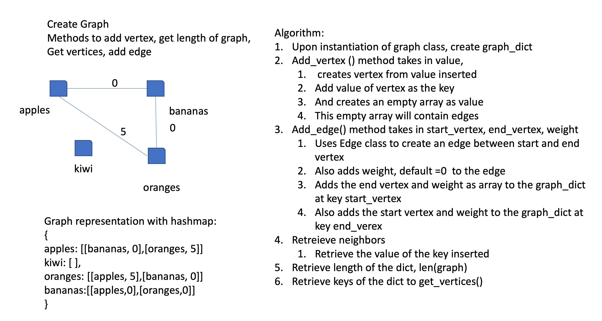

# Graph

[Table of Contents](../../../README.md)

See [solution](graph.py)

__PR__: https://github.com/vijayetar/dsa/pull/28

## Challenge
Implement your own Graph. The graph should be represented as an adjacency list, and should include the following methods:

__AddNode()__
Adds a new node to the graph
Takes in the value of that node
Returns the added node
__AddEdge()__
Adds a new edge between two nodes in the graph, include the ability to have a “weight”
Takes in the two nodes to be connected by the edgeb both nodes should already be in the Graph
__GetNodes()__
Returns all of the nodes in the graph as a collection (set, list, or similar)
__GetNeighbors()__
Returns a collection of edges connected to the given node
Takes in a given node
Include the weight of the connection in the returned collection
__Size()__
Returns the total number of nodes in the graph

## Approach and Efficiency
I made graph a class that upon instantiation will create a dictionary, which will allow me to access the vertices in O(1) approach, understanding that it will use the hashmap technique to do it, and so depending on the size of the hashmap, the efficiency is not exactly of O(1) depending on the collisions.

__add_vertex method__ : is O(1) efficiency
__add_edge method__ : is O(1) efficiency
__get_vertices method__ : is O(n)* efficiency
__get_neighbors method__ : is O(1)* efficiency

Space- no new objects are created as intermediate containers.  Also by using hashmaps to create graphs, help decrease space and time complexity.

## Specifications Used
* .editorconfig
* .gitattributes
* .gitignore

## Solution

## Checklist
 - [x] Top-level README “Table of Contents” is updated
 - [x] Feature tasks for this challenge are completed
 - [x] Unit tests written and passing
     - [x] “Happy Path” - Expected outcome
     - [x] Expected failure
     - [x] Edge Case (if applicable/obvious)
 - [x] README for this challenge is complete
     - [x] Summary, Description, Approach & Efficiency, Solution
     - [x] Link to code
     - [x] Picture of whiteboard
