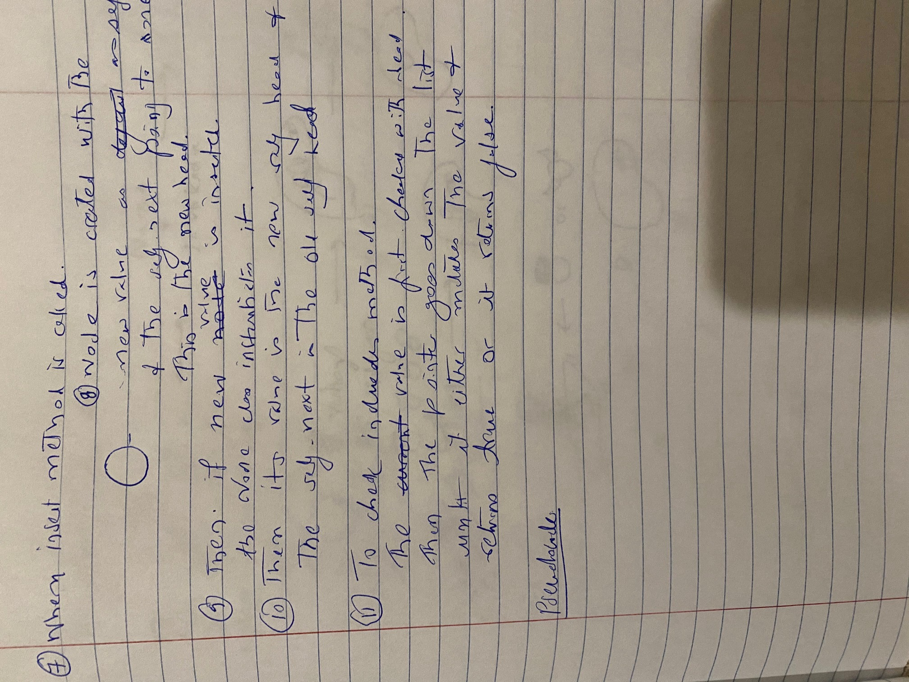
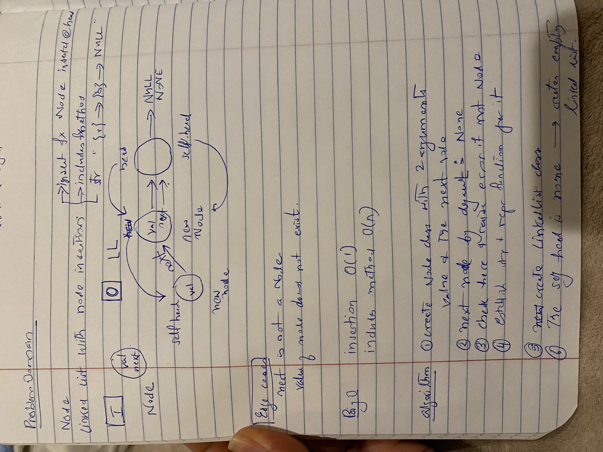

# Sum of numbers in a Matrix

[Table of Contents](../../../README.md)

See [solution](linked_list.py)

__Pull Request__:https://github.com/vijayetar/dsa/pull/3

## Challenge
* Create a Node class that has properties for the value stored in the Node, and a pointer to the next Node.
* Within your LinkedList class, include a head property. Upon instantiation, an empty Linked List should be created.
* Define a method called __insert__ which takes any value as an argument and adds a new node with that value to the head of the list with an O(1) Time performance.
Define a method called __includes__ which takes any value as an argument and returns a boolean result depending on whether that value exists as a Node’s value somewhere within the list.
Define a method called __toString__ (or __str__ in Python) which takes in no arguments and returns a string representing all the values in the Linked List, formatted as:
"{ a } -> { b } -> { c } -> NULL"

## Approach and Efficiency
The approach for this seems straight forward in creating Node class with O(1) function and then a linked list
Since each node points to the next node, they are not stored in the same location. There is definitely more storage efficiency.
WRT to the insert method, it appends at the head, and so it is O(1) as well.
However, the includes method is O(n) since it is dependent on the the length of the linked list.

## Specifications Used
* .editorconfig
* .gitattributes
* .gitignore

## Solution

## Checklist
 - [x] Top-level README “Table of Contents” is updated
 - [x] Feature tasks for this challenge are completed
    - [x] Node class created with attributes value and next
    - [x] It also raises error with the argument for next value is not a node
    - [x] Empty linked list is created on instantiating
    - [x] Method insert created to make new head each time it is called
    - [x] method includes created to check if value of the node exits
    - [ ] method insert created to pass multiple arguments
 - [x] Unit tests written and passing
     - [x] “Happy Path” - Expected outcome
     - [x] Expected failure
     - [x] Edge Case (if applicable/obvious)
 - [x] README for this challenge is complete
     - [x] Summary, Description, Approach & Efficiency, Solution
     - [x] Link to code
     - [x] Picture of whiteboard
