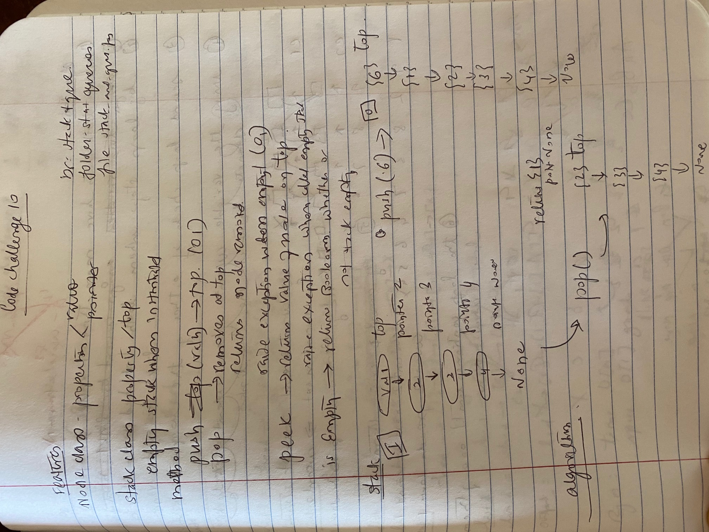

# Stacks and Queues

[Table of Contents](../../../README.md)

[Solution](stack_and_queues.py)

__PR request__: https://github.com/vijayetar/dsa/pull/10

## Challenge
* Create a Node class with properties of values and pointer
*  Create a Stack class that has a top property. *  It creates an empty Stack when instantiated.
*  This object should be aware of a default empty value assigned to top when the stack is created.
* Define a method called __push__ which takes any value as an argument and adds a new node with that value to the top of the stack with an O(1) Time performance.
* Define a method called __pop__ that does not take any argument, removes the node from the top of the stack, and __returns the node’s value__.
* Should __raise exception__ when called on empty stack
* Define a method called __peek__ that does not take an argument and returns the value of the node located on top of the stack, without removing it from the stack.
*  Should __raise exception__ when called on empty stack
* Define a method called __isEmpty__ that takes no argument, and returns a boolean indicating whether or not the stack is empty.

## Approach and Efficiency
I tried using the same technique as how we made Linked Lists and created the Stack and the queue.

I assigned the empty stack with a top assigned to None.  As each new value is pushed to the top of the stack, each time a new Nodr is added, the top is reassigned in O(1) of time and space.

Similarly, the pop() method uses O(1) of time and space by removing the  node from the top and then reassigning the top to the next node in the Stack. I used the same approach or isEmpty() and peek() methods.

The Queue was a lot more challenging.  After assigining self.rear and self.front attributes to None in an empty queue, I was able to reassign them as more values were added into the queue. With each enqueu, the new node was added after the self.rear. I was then able to reassign the self.rear to the new node with each addition.  This allowed the changes to take place in O(1) time and space efficiency.

Similarly, the dequeue, peek and isEmpty methods involved returning the self.front value and reassigning it to the next node, or returning the value with the queue unchanged.  This process was also done in O(1) time and space.

## Specifications Used
* .editorconfig
* .gitattributes
* .gitignore

## Solution

## Checklist
 - [x] Top-level README “Table of Contents” is updated
 - [x] Feature tasks for this challenge are completed
 - [x] Unit tests written and passing
     - [x] “Happy Path” - Expected outcome
     - [x] Expected failure
     - [x] Edge Case (if applicable/obvious)
 - [x] README for this challenge is complete
     - [x] Summary, Description, Approach & Efficiency, Solution
     - [x] Link to code
     - [x] Picture of whiteboard
