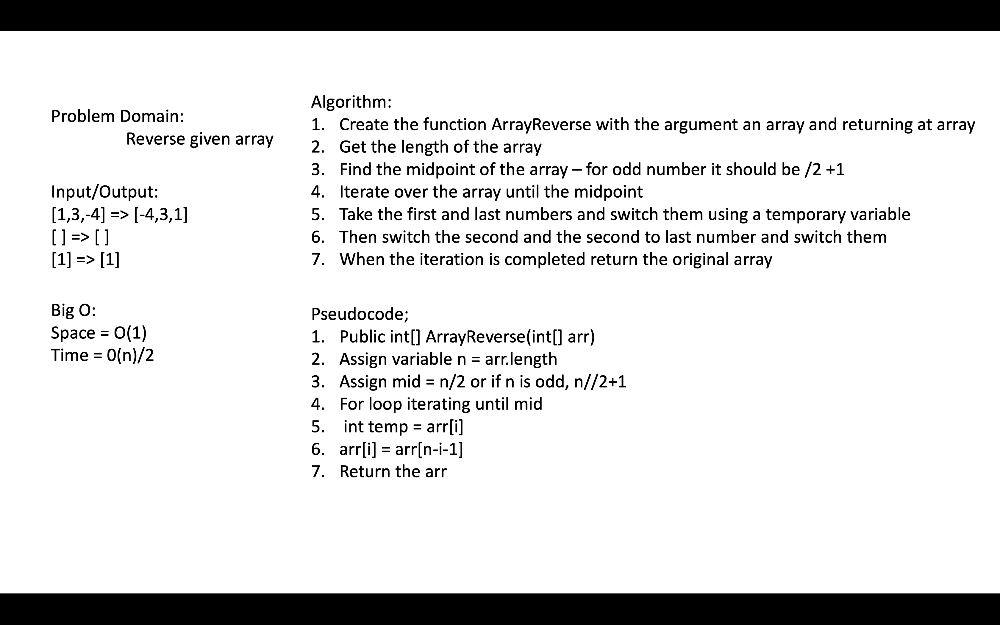

# Array Reverse

[Table of Contents](../../../README.md)

See [solution](ArrayReverse.java)

__PR__:https://github.com/vijayetar/dsa/pull/41

## Challenge
Write a function called reverseArray which takes an array as an argument. Without utilizing any of the built-in methods available to your language, return an array with elements in reversed order.

## Approach and Efficiency
I am reversing in place so space is O(1) using a temporary variable that changes value each time. Each reversal is a two step process using a temporary variable but I only do it for half the length of the array, so the efficiency is 2n/2 or O(n)

## Specifications Used
* .gitignore

## Solution

## Checklist
 - [x] Top-level README “Table of Contents” is updated
 - [x] Feature tasks for this challenge are completed
 - [x] README for this challenge is complete
     - [x] Summary, Description, Approach & Efficiency, Solution
     - [x] Link to code
     - [x] Picture of whiteboard
