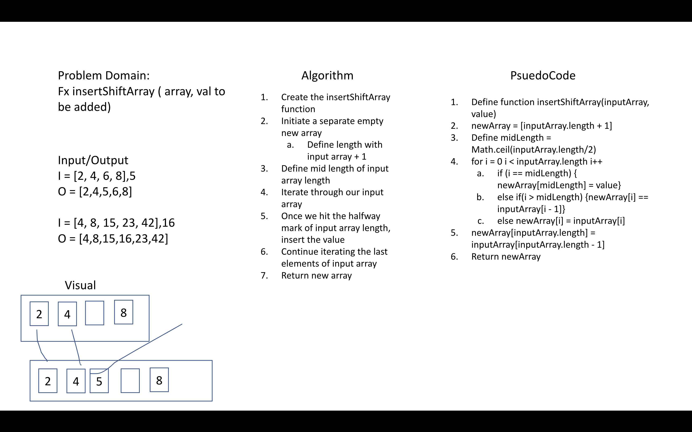

# Insert Shift Array

[Table of Contents](../../../README.md)

__PR__:

## Challenge
Write a function called insertShiftArray which takes in an array and the value to be added.

## Approach and Efficiency
We had to create another array so space was O(n*2) and efficiency O(n)

## Specifications Used
* .editorconfig
* .gitattributes
* .gitignore

## Solution

## Checklist
 - [x] Top-level README “Table of Contents” is updated
 - [x] Feature tasks for this challenge are completed
 - [x] Unit tests written and passing
     - [x] “Happy Path” - Expected outcome
     - [x] Expected failure
     - [x] Edge Case (if applicable/obvious)
 - [x] README for this challenge is complete
     - [x] Summary, Description, Approach & Efficiency, Solution
     - [x] Link to code
     - [x] Picture of whiteboard
