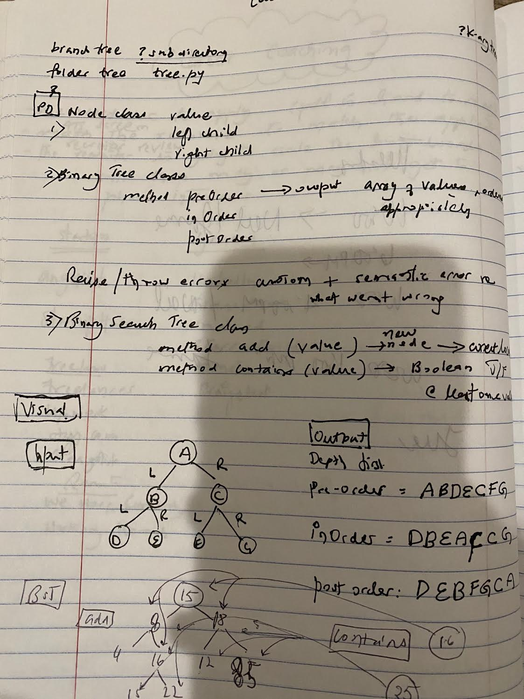

# Trees and Binary Search Trees

[Table of Contents](./../../../../../../README.md)

## Challenge
* Create a __Node class__ with the left child pointing, and the right child pointing to node.
* Create a __BinaryTree class__
* Define a method for each of the depth first traversals called __preOrder, inOrder, and postOrder__ which returns an array of the values, ordered appropriately.
* Any __exceptions or errors that come from your code should be semantic, capturable errors__. For example, rather than a default error thrown by your language, your code should raise/throw a custom, semantic error that describes what went wrong in calling the methods you wrote for this lab.

* Create a __BinarySearchTree class__
* Define a method named __add__ that accepts a value, and adds a new node with that value in the correct location in the binary search tree.
* Define a method named __contains__ that accepts a value, and returns a boolean indicating whether or not the value is in the tree at least once.

## Approach and Efficiency
* __Binary Tree__:
The Big O time complexity for insertion can be O(n) if all the nodes have to be evaluated. However by using the breadth first traversal, it is now O(largest width) of the tree.

* __Binary Search Tree__:
The Big O time complexity of a Binary Search Tree’s __insertion__ and __search__ operations is O(height). In the worst case, we will have to search all the way down to a leaf, which will require searching through as many nodes as the tree is tall. In a balanced (or “perfect”) tree, the height of the tree is log(n). In an unbalanced tree, the worst case height of the tree is n.

The Big O space complexity of a BST search would be O(1). During a search, we are not allocating any additional space.

## API  : Description of the methods
* __class Binary Tree__:
a. add: Takes a single argument value, and adds argument to the Binary Tree using breadth first traversal
b. preOrder: Returns list with node values in depth first traversal in the preorder method
c. inOrder: Returns list with node values in depth first traversal in the inorder method
d. postOrder: Returns list with node values in depth first traversal in the postorder method
e. breadthTraversal: Returns list with node values in breadth traversal manner

* __sub class Binary Search Tree__:
a. add: Takes argument an integer and adds to the Binary Search tree so that if it is less than the root, it is placed left, and if it is more than the root, then it is placed rightof the root
b. contains: Takes in a single argument an integer value and returns Boolean if the Binary Search Tree contains the value

*__class Queue__:
a. enqueue: Takes any node as an argument and adds it to the back of the queue
b. dequeue: Removes the node from the front of the queue, and returns the node
c. peek: Returns the value of the node located in the front of the queue
d. isEmpty: returns True if the Queue is empty

## Specifications Used
* .editorconfig
* .gitattributes
* .gitignore

## Solution

## Checklist
 - [x] Top-level README “Table of Contents” is updated
 - [x]  Feature tasks for this challenge are completed
 - [x] Unit tests written and passing
     - [x] “Happy Path” - Expected outcome
     - [x] Expected failure
     - [x] Edge Case (if applicable/obvious)
 - [x] README for this challenge is complete
     - [x] Summary, Description, Approach & Efficiency, Solution
     - [x] Link to code
     - [x] Picture of whiteboard
