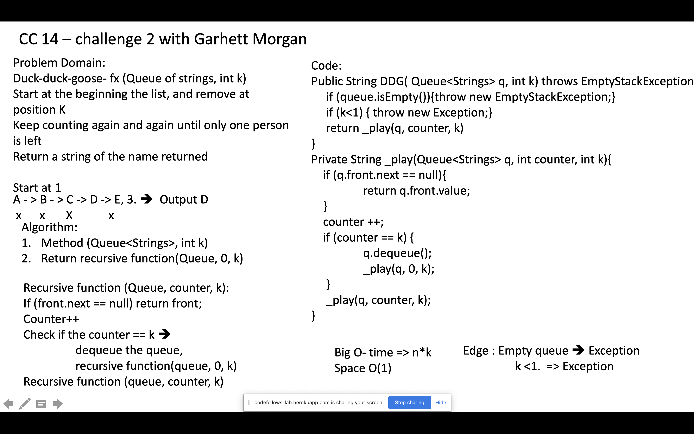

# Duck Duck Goose

[Table of Contents](./../../../../../../README.md)

## Challenge
Write a function called __DuckDuckGoose()__ that accepts a list or any object of strings and an int k. Start at the beginning of the list and count up to k and remove the person at that index from the list. Keep counting from that index and count up to k over and over until only one person is left in the list. Return a string with the name of the last person left in the list.

## Method
I used a queue of strings to enqueue and dequeue, and a counter to remove the kth value each recursive function called until only one value is left in the queue.

## Efficiency
This method takes O(n * k) time and uses O(1) extra space.
