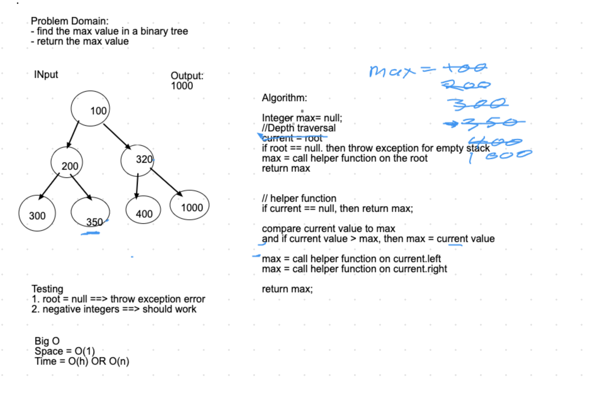

# Find Max Sum and Max Number in Binary Tree

[Table of Contents](./../../../../../../README.md)

## Challenge
Write an __instance method__ called __find-maximum-value__. Without utilizing any of the built-in methods available to your language, __return the maximum value__ stored in the tree. You can assume that the values stored in the Binary Tree will be numeric.

__findMaxSum__ finds the maximum sum of the edges to the leaf. The function does a depth first traversal and finds the sum until the node is null, and then compares with the maxSum, and reassigns to sum if the maxSum is less than sum.  However, as it recurses back up the edge, it will subtract the value of the left node or the right node and then adds the new values again as it courses down towards the next leaf.  This is done recursively.

## Approach and Efficiency
I used an O(n) approach to finding the maximum using a max value as an argument in a recursive function that compares the root value against the max value and finds the maximum number that is returned through each recursion and then returned at the end of the function execution.

Efficiency is O(n) or O(h) for both
Space is O(1) for both

## Checklist
 - [x] Top-level README “Table of Contents” is updated
 - [x] Feature tasks for this challenge are completed
 - [x] Unit tests written and passing
     - [x] “Happy Path” - Expected outcome
     - [x] Expected failure
     - [x] Edge Case (if applicable/obvious)
 - [x] README for this challenge is complete
     - [x] Summary, Description, Approach & Efficiency, Solution
     - [x] Link to code
     - [x] Picture of whiteboard
