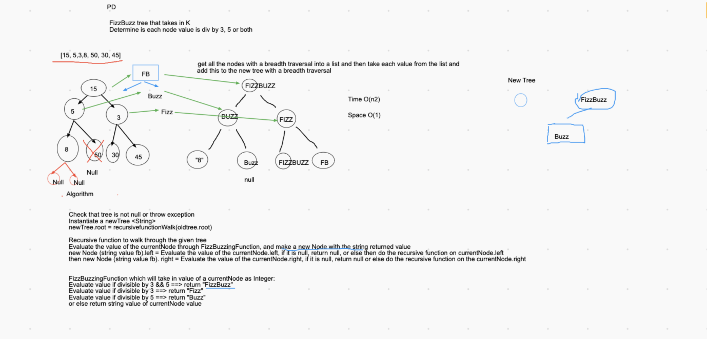

# Fizz Buzz A Tree

[Table of Contents](./../../../../../../README.md)

## Challenge
* Write a function called __FizzBuzzTree__ which takes a tree as an argument.
* __Create a new tree__ with the same structure as the original, but the values modified as follows:
*  If the value is divisible by 3, replace the value with “Fizz”
*  If the value is divisible by 5, replace the value with “Buzz”
*  If the value is divisible by 3 and 5, replace the value with “FizzBuzz”
*  If the value is not divisible by 3 or 5, simply turn the number into a String.
* Return the new tree.

## Approach and Efficiency
I created a class fizzbuzz extend it from Tree with a method that took in an argument tree\<Integer>. upon calling the function, it also raised error if the tree had no root.

Then a new binary tree was instantiated.  this will be the tree with fizzbuzz results and returned.

The walk function is a recursive function that takes in an argument of the root node of the argument and then evaluates each node in pre order manner. it will then call the fizzbuzz function to return a Node that will then be added to the new tree.

The Big 0 for time is at the worst case O(n) as it traverses the entire tree, and for a balanced tree it is O(h) where h = height = log n, the Big O for space is O(n) since we are creating a second tree

Other way to do it is with a breadth traversal for both removing and adding to it, and since it uses a queue both times, it has the worst Big O with time of O(n^2) and space of O(n)

## Specifications Used
* .gitignore

## Checklist
 - [x] Top-level README “Table of Contents” is updated
 - [x] Feature tasks for this challenge are completed
 - [x] Unit tests written and passing
     - [x] “Happy Path” - Expected outcome
     - [x] Expected failure
     - [x] Edge Case (if applicable/obvious)
 - [x] README for this challenge is complete
     - [x] Summary, Description, Approach & Efficiency, Solution
     - [x] Link to code
     - [x] Picture of whiteboard
